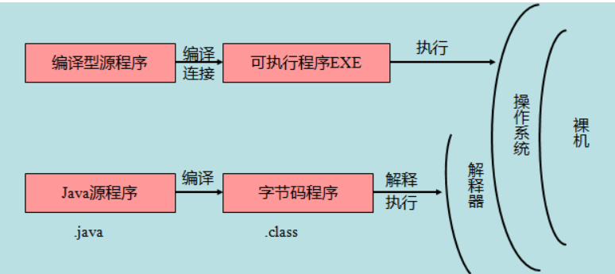

### 基本语法

* **类名的首字母应该大写**。如果类名由若干单词组成，那么每个单词的首字母应该大写。
* **方法名应该以小写字母开头**。如果方法名含有若干单词，则后面的每个单词首字母大写。
* **源文件名必须和类名相同**。
* 所有的 Java 程序由 **public static void main(String[] args)** 方法开始执行。

### Java 变量

- 局部变量
- 类变量（静态变量）
- 成员变量（非静态变量）

### Java 数组

> 数组是储存在堆上的对象

### Java 源程序与编译型运行区别

