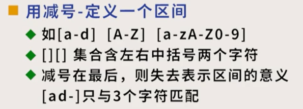
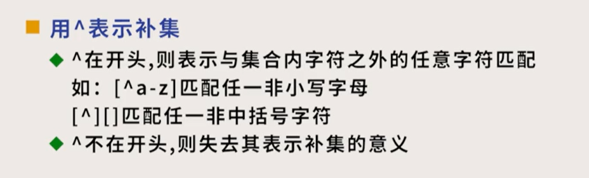
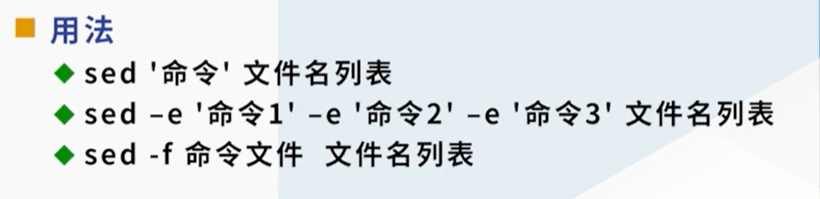

---

title: "Part 2"
date: 2021-09-02T06:00:20+06:00
hero: /images/posts/writing-posts/hugo-logo.svg
math: true
menu:
  sidebar:
    name: Part 2
    identifier: Part 2
    parent: Linux
    weight: 10
---

# Part 2

---

## 1 正则表达式

### 1.1 基础

> 正则表达式与文件匹配符规则不同。

六个元字符：. * $ ^ [ \

* . 代表任意字符
* x* 代表任意多个x（0-n个）
* 123$ 代表匹配文件行尾的123
* ^123 代表匹配每行起始的123
* []用于定义区间
* \1 \2代表前面的第一部分和第二部分

定义集和

 

 

* ERE、PCRE：扩展的正则表达式

### 1.2 跟正则表达式相关的命令

* grep/egrep/fgrep

  * 语法：grep 模式 文件名列表
  * egrep：用扩展正则表达式搜索
  * fgrep：快速搜索字符串，不用正则表达式规则

* sed：流编辑

   

* awk：逐行扫描进行文本处理的一门语言

