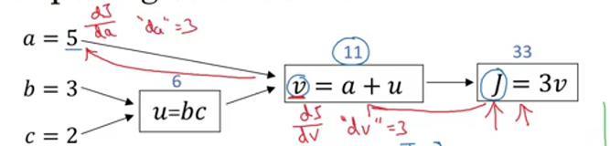
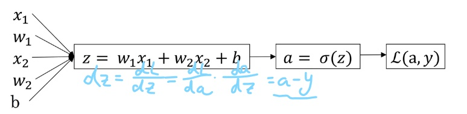
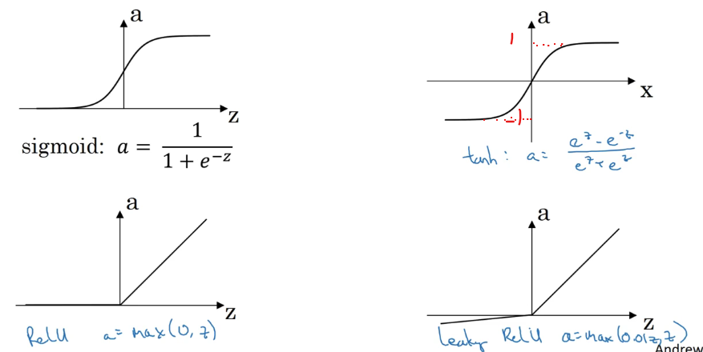

---

title: "DL基础"
date: 2021-08-05T06:00:20+06:00
hero: ../../../static/images/posts/writing-posts/hugo-logo.svg
math: true
menu:
  sidebar:
    name: DL基础
    identifier: DL基础
    parent: ML
    weight: 10
---

# Deep Learning 基础

---

## 1 Logistic Regression Model

### 1.1 Binary Classification

> To learn a classifier that can input an image represented by the feature vector `x`, and predict the corresponding label `y`.
>

**Notation——n training examples**: ($ n_x $为向量维数，$X$为$ n_x\times m $矩阵)
$$
(x^{(1)},y^{(1)}),(x^{(2)},y^{(2)}), ..., (x^{(m)},y^{(m)}),x\in R^{n_x}, y\in \{0,1\}
$$

$$
  X=[x^{(1)},x^{(2)},...,x^{(m)}], X\in R^{n\times m}
$$

$$
  Y=[y^{(1)},y^{(2)},...,y^{(m)}], Y\in R^{1\times m}
$$


### 1.2 Logistic Regression

> An algorithm for *binary classification* problems.

Given `x`, we want $\hat{y}=P(y=1|x)$​

**Way**:

* Parameters: $w\in R^{nx},b\in R$

* Output: （$\sigma$为sigmoid函数，$\sigma(z)=\frac{1}{1+e^{-z}}$）

  $$
  \hat{y}=\sigma(w^Tx+b), (z = w^Tx+b)
  $$

### 1.3 Cost Function

we want $\hat{y(i)}\approx y(i)$

**Loss(error) function**: $L(\hat{y},y)=-(y·log\hat{y}+(1-y)log(1-\hat{y}))$​

* $\hat{y(i)}$与$y(i)$越接近，$L(\hat{y},y)$越小
* If $y=1$: $L(\hat{y},y)=-log\hat{y}$
* If $y=0$: $L(\hat{y},y)=-log(1-\hat{y})$

> It measures how well you're doing <u>on a single training example</u>.

**Cost function**:$J(w,b)=\frac{1}{m}\sum_{i = 1}^{m}L(\hat{y}^{(i)},y^{(i)})$

> It measures how well you're doing <u>on the entire training set</u>.

### 1.4 Gradient Descent

> An algorithm to learn the parameteres `w` and `b` on your training set.

$$
w := w-\alpha\frac{\partial J(w,b)}{\partial w}, b:=b-\alpha\frac{\partial J(w,b)}{\partial b}
$$

$\alpha$​​​​ is the <u>learning rate</u>.

Derivatives (导数)

#### Computation Graph

<u>backward propagation</u>



在代码中，可以用`dv`，`da`作为变量名。

$$
\frac{dJ}{dc}=\frac{dJ}{dv}\frac{dv}{du}\frac{du}{dc}=3\times1\times3=9
$$

#### Gradient Descent on *1* example


$$
w_1 := w_1-\alpha\frac{\partial dL}{\partial w},w_2 := w_2-\alpha\frac{\partial dL}{\partial w2},b := b-\alpha\frac{\partial dL}{\partial b}
$$

#### Gradient Descent on *m* examples

> Neural network programming guideline: Whenever possible, avoid explicit for-loops. 

> Use <u>vectorization</u>.

**Forward Propagation:**
$$
A=\sigma\left(w^{T} X+b\right)=\left(a^{(1)}, a^{(2)}, \ldots, a^{(m-1)}, a^{(m)}\right)
$$

* **Cost function:**

$$
J=-\frac{1}{m} \sum_{i=1}^{m}\left(y^{(i)} \log \left(a^{(i)}\right)+\left(1-y^{(i)}\right) \log \left(1-a^{(i)}\right)\right)
$$

**Backward Propagation**:

$$
\frac{\partial J}{\partial w}=\frac{1}{m} X(A-Y)^{T}
$$


$$
\frac{\partial J}{\partial b}=\frac{1}{m} \sum_{i=1}^{m}\left(a^{(i)}-y^{(i)}\right)
$$

**Code of Optimizing procedure:**

```python
def propagate(w, b, X, Y):
    m = X.shape[1]
    
    # Forward propogation
    A = sigmoid(np.dot(w.T, X)+b);
    cost = -np.average(Y*np.log(A)+(1-Y)*np.log(1-A))
    
    #Backward propagation
    dw = np.dot(X, (A-Y).T)/m
    db = np.average(A-Y)

    cost = np.squeeze(np.array(cost))
    grads = {"dw": dw,
             "db": db}
    return grads, cost


def optimize(w, b, X, Y, num_iterations=100, learning_rate=0.009, print_cost=False):
    for i in range(num_iterations):
            grads, cost = propagate(w, b, X, Y)
            dw = grads["dw"]
            db = grads["db"]
            w = w - learning_rate*dw;
            b = b - learning_rate*db;
```

### 1.5 Python Skill

**Broadcasting**

```python
A = np.array([1,2,3,4],
			[5,6,7,8],
			[9,10,11,12])
cal = A.sum(axis=0) # axis=0垂直方向求和,axis=1水平方向求和
percentage=A/cal.reshape(1,4) # broadcasting(1,4)->(3,4))
```

> 不要用rank=1(秩为1)的array,而要用5*1的矩阵

```python
a = np.random.randn(5) # bad
a = np.random.randn(5,1) # good
assert(a.shape==(5,1))
```

## 2 One hidden layer Neural Network

### 2.1 Neural Network Representation

> One hidden layer NN also called a two layer NN (不算输入层)


### 2.2 Forward Propagation

#### On <u>single training example</u>:

$$
z^{[1]}=W^{[1]} x+b^{[1]}, a^{[1]}=\sigma(z^{[1]}) 
$$

$$
z^{[2]}=W^{[2]} a^{[1]}+b^{[2]}, a^{[2]}=\sigma(z^{[2]})
$$

#### vectorizing across <u>multiple examples</u>:


$$
Z^{[1]} =W^{[1]} X+b^{[1]},A^{[1]}=g^{[1]}(Z^{[1]}),
$$

$$
Z^{[2]} =W^{[2]} A^{[1]}+b^{[2]},A^{[2]}=g^{[2]}(Z^{[2]})=\sigma(Z^{[2]})
$$

### 2.3 Activation functions

* tanh: $a=\frac{e^z-e^{-z}}{e^z+e^{-z}}$

> tanh函数在绝大多数场景下比$\sigma$​函数更适合用作激活函数；唯独在binary classification的输出层，$\sigma$​​函数更适合用作激活函数。

* Relu: a=max(0, z)

> Relu函数可解决梯度消失的问题，优于tanh函数和$\sigma$​函数。除了输出层，默认作为激活函数。

* Leaky Relu: a = max(0.01z, z)



### 2.4 Derivatives of Activation functions

* g(z)=$\sigma$​(z):      $g'(z)=a(1-a)$
* g(z)=tanh(z):  $g'(z)=1-a^2$​
* ReLU:           

$$
g'(z)=\left\\{
\begin{aligned}
0 &  & z<0 \\\\ 1 &  & z\geq0
\end{aligned}
\right.
$$

* Leaky ReLU:

$$
g'(z)=\left\\{
\begin{aligned}
0.01 &  & z<0 \\\\ 1 &  & z\geq0
\end{aligned}
\right.
$$

### 2.4 Gradient descent for neural networks

backward propagation:

$$
dZ^{[2]}=A^{[2]}-Y
$$

$$ 
dW^{[2]}=\frac{1}{m}dZ^{[2]}A^{[1]T}
$$ 

$$
db^{[2]}=\frac{1}{m}np.sum(dZ^{[2]},axis=1,keepdim=True)
$$

$$
d Z^{[1]}=W^{[2] T} d Z^{[2]} * g^{[1]^{\prime}}\left(\mathrm{Z}^{[1]}\right)
$$

$$
d W^{[1]}=\frac{1}{m} d Z^{[1]} X^{T}
$$

$$
d b^{[1]}=\frac{1}{m} np.sum(d Z^{[1]}, axis=1, keepdims=True)
$$

* keepdim=True: 用于防止输出$(n^{[2]},)$，而是输出$(n^{[2]},1)$

### 2.5 Random Initialization

> 在Neural network中，w不能初始化为全0。

$$
w^{[1]}=np.random.randn((2,2))*0.01
$$

$$
b^{[2]}=np.zero((2,1))
$$

$$
w^{[1]}=np.random.randn((1,2))*0.01
$$

$$
b^{[2]}=0
$$

