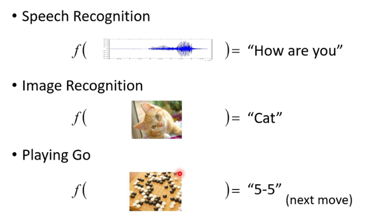
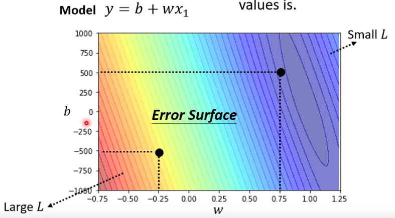
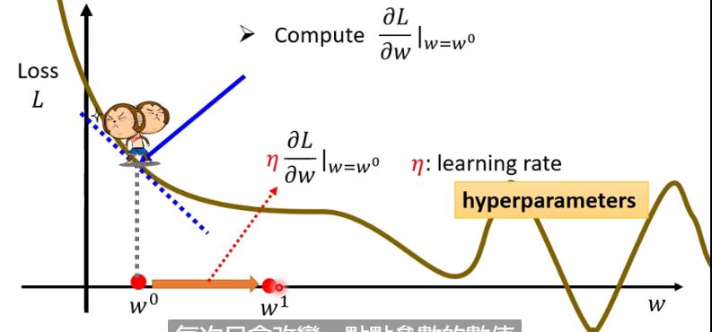
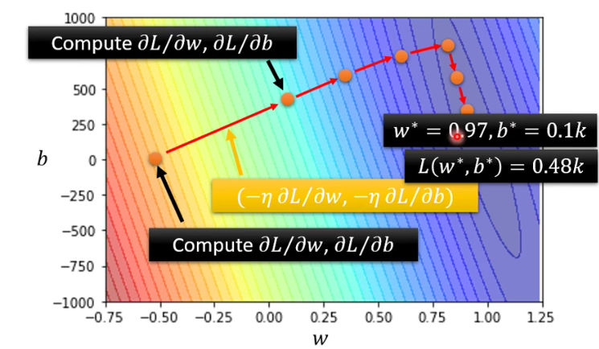

---

title: "李宏毅-机器学习2021春-1"
date: 2021-08-05T06:00:20+06:00
hero: /images/posts/writing-posts/hugo-logo.svg
math: true
menu:
  sidebar:
    name: 李宏毅-机器学习2021春-1
    identifier: 李宏毅-机器学习2021春-1
    parent: ML
    weight: 10
---

# 李宏毅-机器学习2021春-1

---

## 1 机器学习基本概念

### 1.1 机器学习基本任务

<u>机器学习的基本任务：**寻找一个函数**</u>

不同种类的函数：

* **Regression（回归）**：函数输出一个标量
  * 如：预测PM2.5
* **Clssificatiion（分类）**：给定选项，函数输出选项
  * 如：Alpha Go下棋
* **Structured Learning**：创造一些结构（图片，文件）

### 1.2 通过训练数据定义Loss

Loss 也是一个函数，它的输入是Model中的parameters：
$$
L(b,w)
$$

Loss function：$L=\frac{1}{N}\sum_ne_n$

* Mean Absolute Error(MAE)：$e=|y-\hat{y}|$
* Mean Square Error(MSE)：$e=(y-\hat{y})^2$

### 1.3 Optimization

目标：得到最优的参数。
$$
w^{*}, b^{*}=\arg \min _{w, b} L
$$
方式：**Gradient Descent**

* 一个参数w的情况
  * 随机选取初始值$w^0$
  * 计算$\left.\frac{\partial L}{\partial \mathcal{\imath}}\right|_{w=w^{0}}$
  * learning rate：$\eta$，表示梯度下降的速率
  * 不断更新w：$w^{1} \leftarrow w^{0}-\left.\eta \frac{\partial L}{\partial w}\right|_{w=w^{0}}$

* 两个参数的情况：

$$
\begin{aligned}
&\left.\frac{\partial L}{\partial w}\right|_{w=w^{0}, b=b^{0}} \quad w^{1} \leftarrow w^{0}-\left.\eta \frac{\partial L}{\partial w}\right|_{w=w^{0}, b=b^{0}} \\
&\left.\left.\frac{\partial L}{\partial b}\right|_{w=w^{0}, b=b^{0}} \quad b^{1} \leftarrow b^{0} \circ \eta \frac{\partial L}{\partial b}\right|_{w=w^{0}, b=b^{0}}
\end{aligned}
$$

