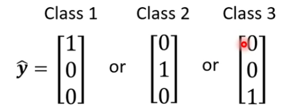
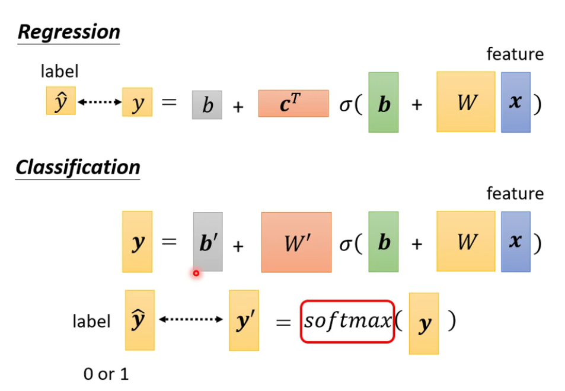
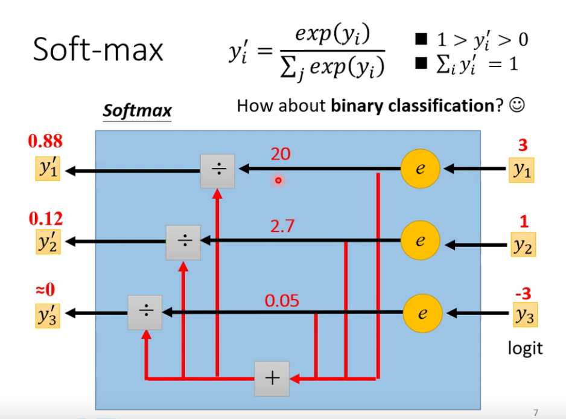
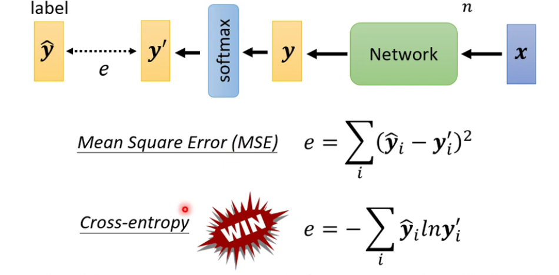
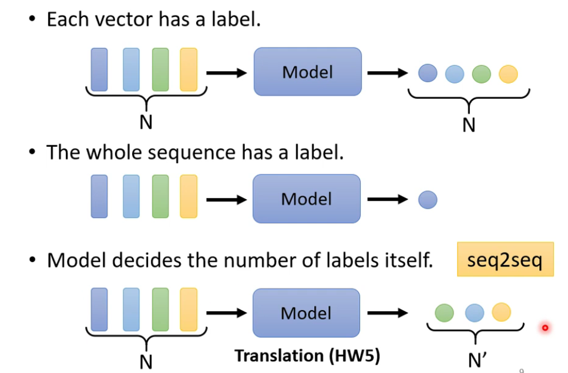
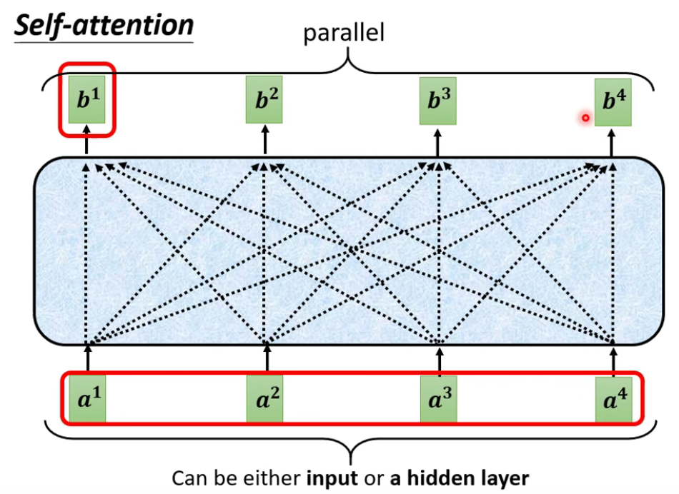
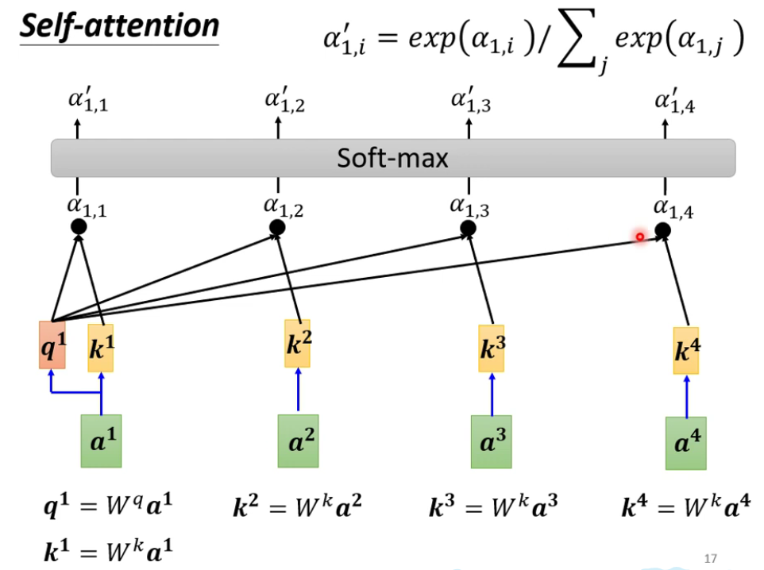
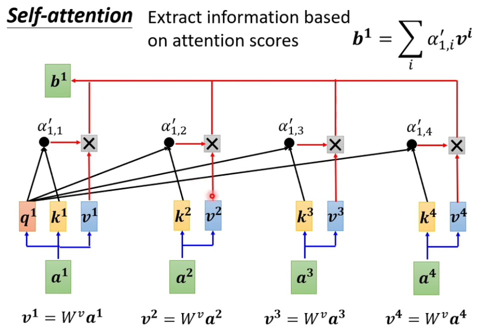
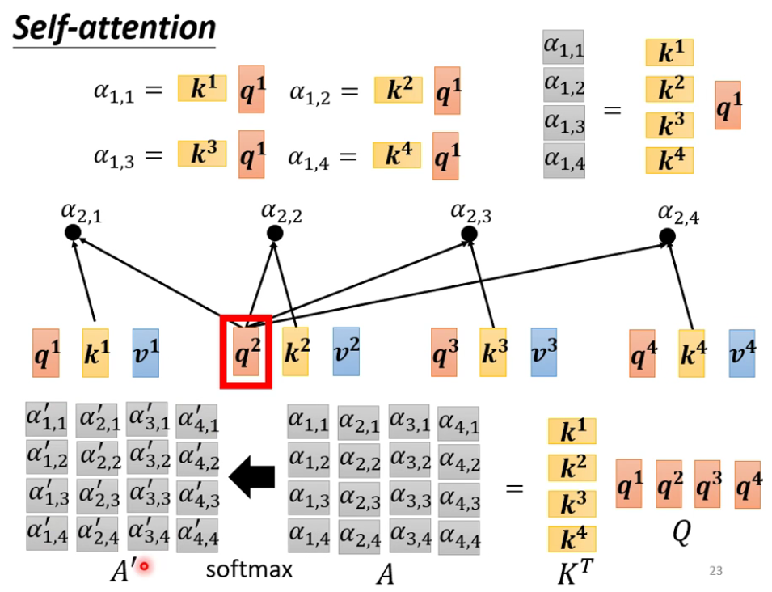
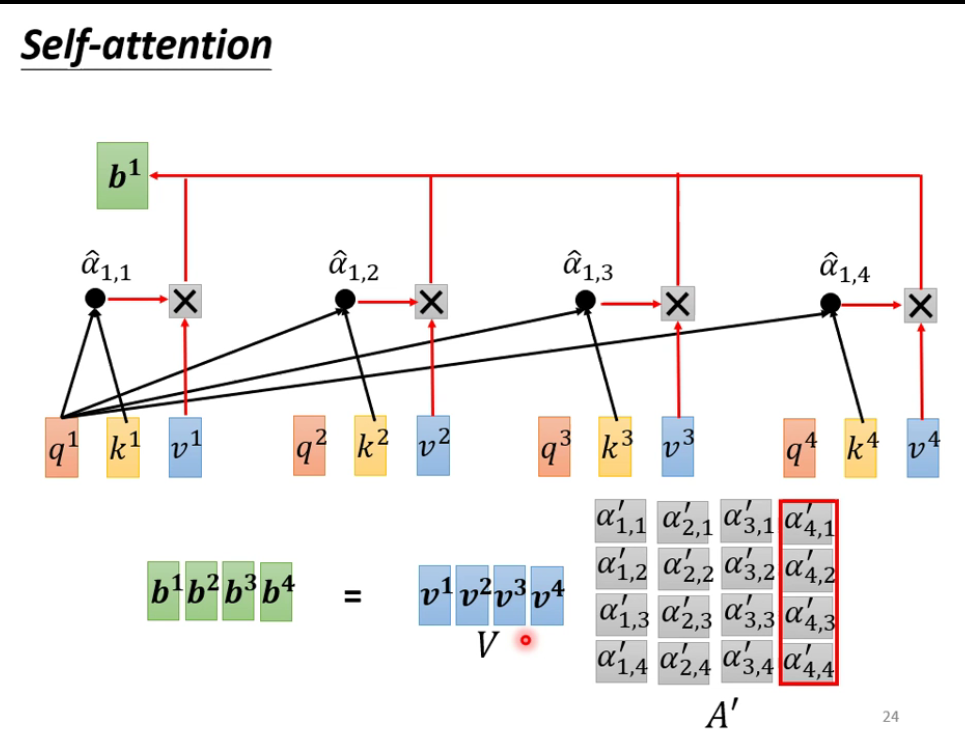

---

title: "李宏毅-机器学习2021春-3"
date: 2021-10-17T06:00:20+06:00
hero: /images/posts/writing-posts/hugo-logo.svg
math: true
menu:
  sidebar:
    name: 李宏毅-机器学习2021春-3
    identifier: 李宏毅-机器学习2021春-3
    parent: ML
    weight: 10
---

# 李宏毅-机器学习2021春-3

---

## 1 Classification

将Class用`one-hot vector`表示

 

回归与分类的区别：

 

softmax：

 

Loss的计算：

 

## 2 Convolutional Neural Network (CNN)

## 3 Self-attention

### 3.1 背景

当输入是多组向量时，输出的情况：

* 每一个向量都有一个label（sequence labeling），用到了**self-attention**
* 整个sequence有一个label
* 模型自己决定输出长度。

 

### 3.2 原理

Self-attention：根据a向量之间的关联性，相应的b向量

 

解释得到$b^1$的过程：

*  
*  ●代表dot-product；此处不一定要用soft-max
*  

完整过程：

*  
*  

### 3.3 变种

在语音辨识中，用于输入的数据很长，可以用Trancated Self-attention，只考虑每一段音频和周围的一定长度内的音频的关系。

