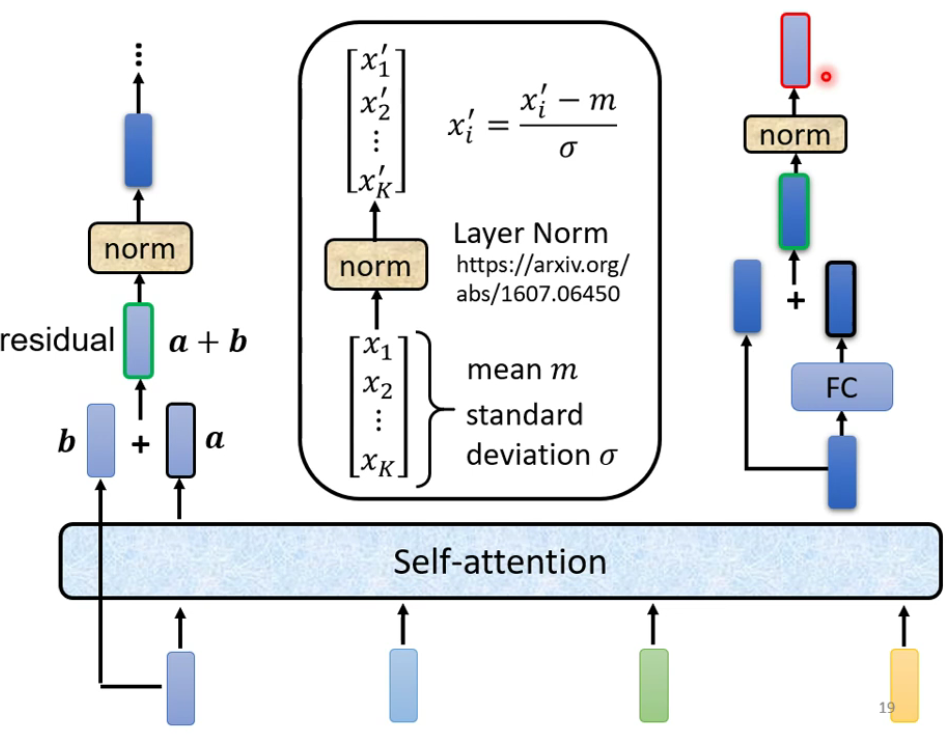
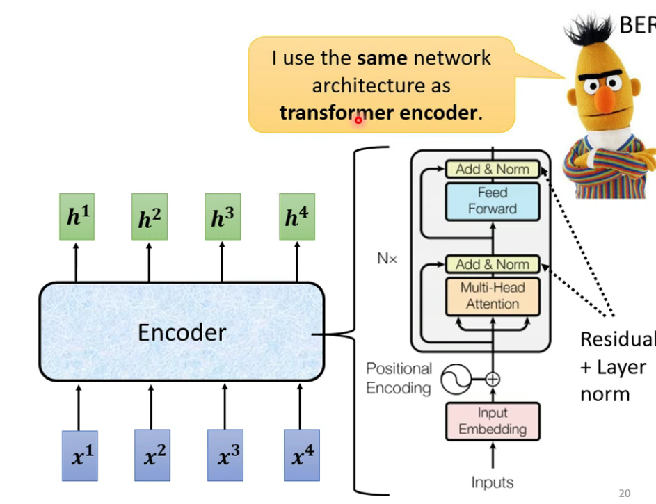

---

title: "李宏毅-机器学习2021春-4"
date: 2021-10-17T06:00:20+06:00
hero: /images/posts/writing-posts/hugo-logo.svg
math: true
menu:
  sidebar:
    name: 李宏毅-机器学习2021春-4
    identifier: 李宏毅-机器学习2021春-4
    parent: ML
    weight: 10
---

# 李宏毅-机器学习2021春-4

---

## 1 Transformer

Sequence-to-sequence（Seq2seq）

* 输出的长度由模型决定
* Encoder+Decoder

### 1.1 Encoder

 

 

### 1.2 Decoder-Autoregressive(AT)

