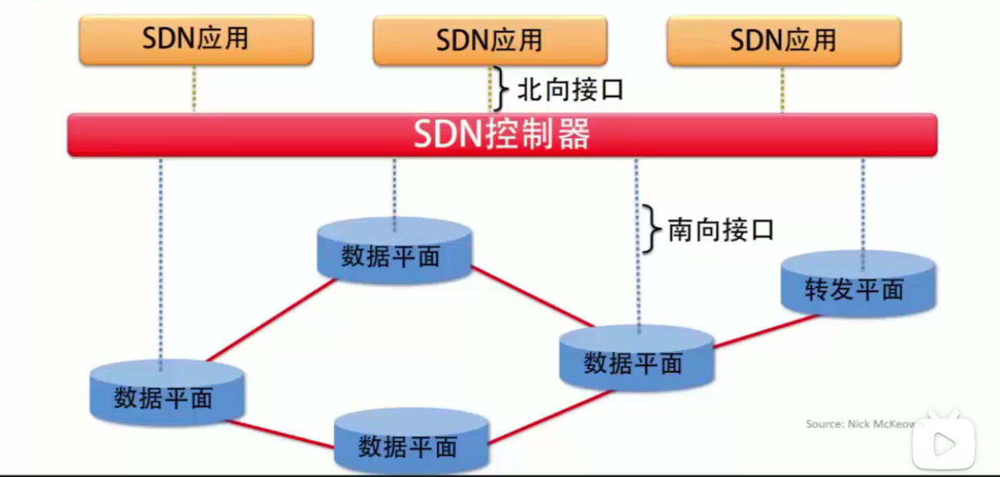

---

title: "SDN 1"
date: 2021-09-02T06:00:20+06:00
hero: /images/posts/writing-posts/hugo-logo.svg
math: true
menu:
  sidebar:
    name: SDN 1
    identifier: SDN 1
    parent: SDN
    weight: 10
---

# SDN 1

---

## 1 SDN概述

### 1.1 SDN之前的网络架构

 

 

### 1.2 SDN定义

* <u>网络控制</u>和<u>转发功能</u>解耦合，使得网络控制功能可直接编程。
* **Openflow**协议是SDN方案的基础。
* SDN的开放分层架构加速了网络产业的参与度，越来越多的网络用户、网络软件公司参与到参与中。

### 1.3 SDN的分层体系结构

 

